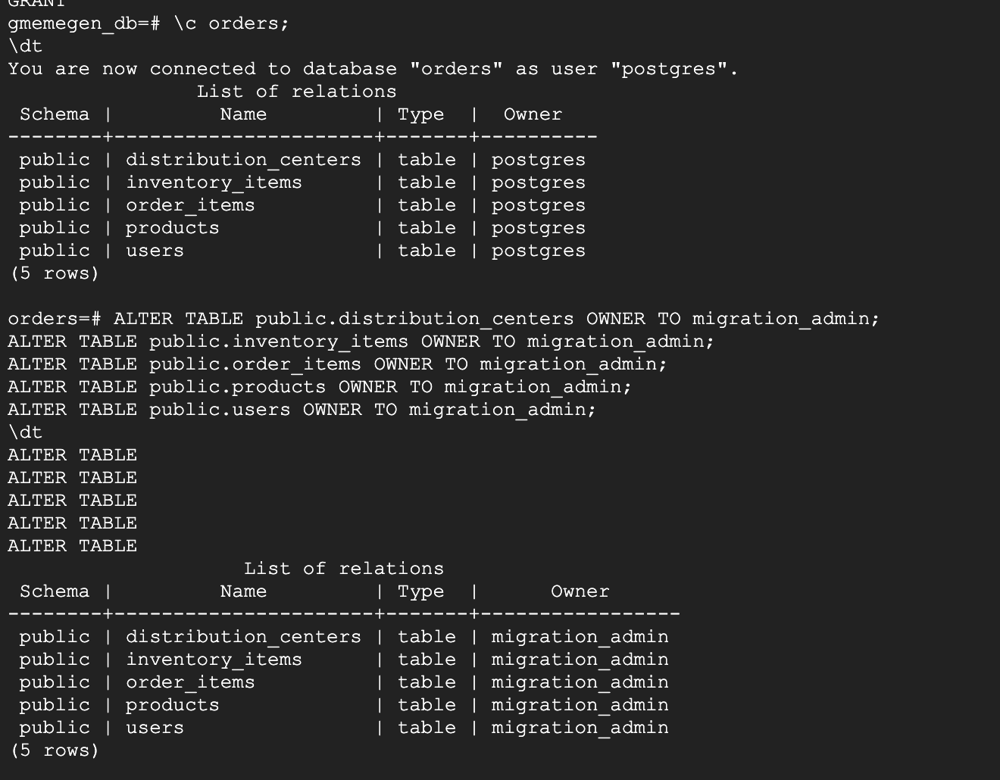

# What is Database Migration Service?

**Database Migration Service** provides options for one-time and continuous jobs to migrate data to Cloud SQL using different connectivity options, including IP allowlists, VPC peering, and reverse SSH tunnels (see documentation on connectivity options at [https://cloud.google.com/database-migration/docs/postgresql/configure-connectivity](https://cloud.google.com/database-migration/docs/postgres/configure-connectivity)).

**What to keep in mind before migrating a database:**

Migrating a database via **Database Migration Service** requires some preparation of the source database, including creating a dedicated user with replication rights, adding the `pglogical` database extension to the source database and granting rights to the schemata and tables in the database to be migrated, as well as the postgres database, to that user.

**What to keep in mind after migrating a database:**

After you create and run the migration job, you confirm that an initial copy of your database has been successfully migrated to your Cloud SQL for PostgreSQL instance. You also explore how continuous migration jobs apply data updates from your source database to your Cloud SQL instance. To conclude the migration job, you promote the Cloud SQL instance to be a stand-alone database for reading and writing data.

Hands-on Lab: https://www.cloudskillsboost.google/course_templates/641/labs/464871

Preparing the source database for migraiton

* Installing and configuring the pglogical database extension.
* Configuring the stand-alone PostgreSQL database to allow access from Cloud Shell and Cloud SQL.
* Adding the `pglogical`database extension to the `postgres`, `orders` and `gmemegen_db` databases on the stand-alone server.
* Creating a `migration_admin` user (with Replication permissions) for database migration and granting the required permissions to schemata and relations to that user.

Some commands that you run in the postgreSQL

student-01-b31ae9b6ba36@postgresql-vm:~$ sudo su - postgres
postgres@postgresql-vm:~$ psql
psql (13.15 (Debian 13.15-1.pgdg110+1))
Type "help" for help.

postgres=# \c postgres;
You are now connected to database "postgres" as user "postgres".
postgres=# CREATE EXTENSION pglogical;
CREATE EXTENSION
postgres=# \c orders;
You are now connected to database "orders" as user "postgres".
orders=# CREATE EXTENSION pglogical;
CREATE EXTENSION
orders=# \c gmemegen_db;
You are now connected to database "gmemegen_db" as user "postgres".
gmemegen_db=# CREATE EXTENSION pglogical;
CREATE EXTENSION
gmemegen_db=# \l
                               List of databases
    Name     |  Owner   | Encoding | Collate |  Ctype  |   Access privileges
-------------+----------+----------+---------+---------+-----------------------
 gmemegen_db | postgres | UTF8     | C.UTF-8 | C.UTF-8 |
 orders      | postgres | UTF8     | C.UTF-8 | C.UTF-8 |
 postgres    | postgres | UTF8     | C.UTF-8 | C.UTF-8 |
 template0   | postgres | UTF8     | C.UTF-8 | C.UTF-8 | =c/postgres          +
             |          |          |         |         | postgres=CTc/postgres
 template1   | postgres | UTF8     | C.UTF-8 | C.UTF-8 | =c/postgres          +
             |          |          |         |         | postgres=CTc/postgres
(5 rows)

In the first column it lists the different databases that are there. 

CREATE USER migration_admin PASSWORD 'DMS_1s_cool!';
ALTER DATABASE orders OWNER TO migration_admin;
ALTER ROLE migration_admin WITH REPLICATION;

Make sure that the new user we created for Migration database is the owner of the tables in the orders database. 

