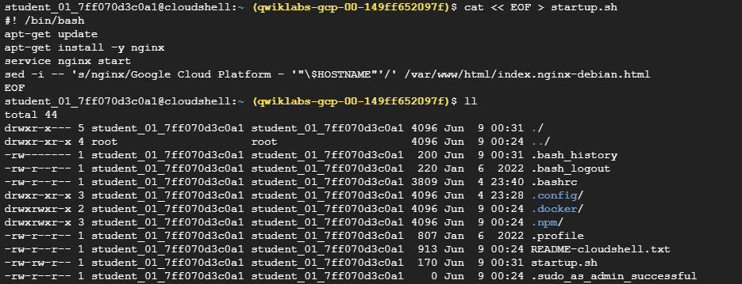

# Create and Manage Cloud Resources: Challenge Lab Solution
Lab-Link: [Here](https://www.cloudskillsboost.google/paths/11/course_templates/648/labs/484536)

*Note: You dont have to use any stupid script to complete this lab.


## Task 1:

Create a project jumphost instance

### Requirements:
Name the instance nucleus-jumphost-512. <br>
Create the instance in the us-east1-c zone. <br>
Use an e2-micro machine type. <br>
Use the default image type (Debian Linux).

This can be simply done from Google Cloud console

## Task 2: 

### Requirements:

- Create an instance template. Don't use the default machine type. Make sure you specify e2-medium as the machine type.
- Create a managed instance group based on the template.
- Create a firewall rule named as accept-tcp-rule-457 to allow traffic (80/tcp).
- Create a health check.
- Create a backend service and add your instance group as the backend to the backend service group with named port (http:80).
- Create a URL map, and target the HTTP proxy to route the incoming requests to the default backend service.
- Create a target HTTP proxy to route requests to your URL map
- Create a forwarding rule.

**Step-by-Step solution**

<font color="red">Before moving on, please change the Region/Zone based on the lab environment you are given. </font>

Step 1:
Create an instance template. Don't use the default machine type. Make sure you specify e2-medium as the machine type.

<br>

First copy the startup script in your cloud shell and save it as is.



Then create the instance template using following command:

```bash
gcloud compute instance-templates lb-backend-template --region=<your lab region> --network=default --metadata-from-file startup-script=startup.sh --machine-type=e2-medium
```
Check the machine time and use the updated machine type from your lab instructions. At the time of writing this code, the machine type was e2-medium.

Step 2:

Creating MIG

```bash
gcloud compute instance-groups managed create nucleus-group --template=lb-backend-template --size=2 --region=us-east1
```
Now you will see total 3 instances in your project. One instance that you created in Objective 1, and two instances coming from your MIG.

*IMPORTANT: Update this backend instance group with named port http:80*

```bash
gcloud compute instance-groups managed set-named-ports lb-backend-group --named-ports http:80 --region <your lab region>
```
This can be done manually from console as well. You have to update the port mapping settings and set it to 80.

What are named-ports?

Named ports in backend instance groups are essentially labels that map a human-readable name to a specific port number on the instances within the group. This allows load balancers to direct traffic to the correct port on the instances using these named labels instead of directly referencing port numbers

Step 3: 

Creating firewall rule named as given in your lab instructions

```bash
gcloud compute firewall-rules create accept-tcp-rule-<number from your lab> --allow tcp:80
```

The ingress rule allows traffic from the Google Cloud health checking systems (130.211.0.0/22 and 35.191.0.0/16).

```bash
gcloud compute firewall-rules create fw-allow-health-check \
  --network=default \
  --action=allow \
  --direction=ingress \
  --source-ranges=130.211.0.0/22,35.191.0.0/16 \
  --target-tags=allow-health-check \
  --rules=tcp:80
```

Create external IPv4 for Load Balancer

```bash
gcloud compute addresses create lb-ipv4-1 \
  --ip-version=IPV4 \
  --global
```

Step 4: 

Creating health-checks

```bash
gcloud compute health-checks create http http-basic-check \
  --port 80
```

Step 5:

Create a backend service and add the instance group as the backend to the backend service group with named port (http:80)

```bash
gcloud compute backend-services create web-backend-service \
  --protocol=HTTP \
  --port-name=http \
  --health-checks=http-basic-check \
  --global
```

What is a backend-service?

A backend service defines how Cloud Load Balancing distributes traffic. The backend service configuration contains a set of values, such as the protocol used to connect to backends, various distribution and session settings, health checks, and timeouts. These settings provide fine-grained control over how your load balancer behaves. To get you started, most of the settings have default values that allow for fast configuration. A backend service is either global or regional in scope.


Add your instance group as the backend to the backend service:

```bash
gcloud compute backend-services add-backend web-backend-service \
  --instance-group=lb-backend-group \
  --instance-group-zone=<as given in your lab> \
  --global
```

Step 6:
<br>Create a URL map, and target the HTTP proxy to route the incoming requests to the default backend service.

```bash
gcloud compute url-maps create web-server-map \
          --default-service web-server-backend
```

Step 7:
Create a target HTTP proxy to route requests to your URL map

```bash
gcloud compute target-http-proxies create http-lb-proxy \
          --url-map web-server-map
```

Step 8: Create a forwarding rule
```bash
gcloud compute forwarding-rules create http-content-rule \
        --global \
        --target-http-proxy http-lb-proxy \
        --ports 80
```

```bash
gcloud compute forwarding-rules list
```

<br>
Wait for 5-7 minutes and then note down the external IP of the load-balancer.

<br>
Go to your browser and use the external IP that you reserved for load balancer, and make an HTTP request on that.
To fetch the external IP, you can also go on your load balancing service -> frontends -> address

<br>
Do that a couple times and see if the ngnix server is changing the instance name on the page after couple refreshes on the same URL.

<br>
If it does that, then it means load balancing is happening behind the scenes.

<br>
<br>

<font color="green">**LAB COMPLETE** </font>
