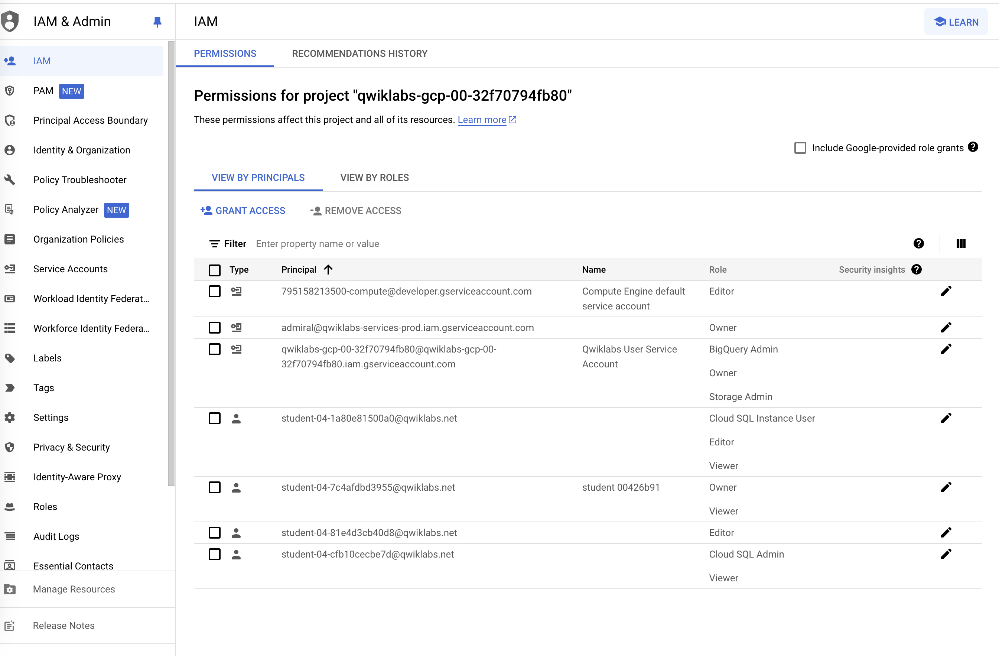

# Challenge Lab Instructions

https://www.cloudskillsboost.google/course_templates/641/labs/464872

## Task 1: Migrate a stand-alone PostgreSQL database to a Cloud SQL for PostgreSQL instance

Prepare the stand-alone PostgreSQL database for migration

Login into the Antern project:

Enable the database migration API and Service networking API.

SSH into the VM -> antern-postgresql-vm

run the following command to install the postgreSQL pslogical.

`sudo apt install postgresql-13-pglogical`

To complete the configuration of the **pglogical** database extension you must edit the PostgreSQL configuration file `/etc/postgresql/13/main/postgresql.conf` to enable the **pglogical** database extension and you must edit the `/etc/postgresql/13/main/pg_hba.conf` to allow access from all hosts.

In `pg_hba.conf` these commands added a rule to allow access to all hosts:

Run the following commands:

sudo su - postgres -c "gsutil cp gs://cloud-training/gsp918/pg_hba_append.conf ."
sudo su - postgres -c "gsutil cp gs://cloud-training/gsp918/postgresql_append.conf ."
sudo su - postgres -c "cat pg_hba_append.conf >> /etc/postgresql/13/main/pg_hba.conf"
sudo su - postgres -c "cat postgresql_append.conf >> /etc/postgresql/13/main/postgresql.conf"

sudo systemctl restart postgresql@13-main

Create a dedicated user for database migration on the stand-alone database.

CREATE USER import_user PASSWORD 'DMS_1s_cool!';

ALTER DATABASE orders OWNER TO import_user;

ALTER ROLE import_user WITH REPLICATION;

Once this is done, we have to assign permissions to the import_user

for this lab, if you do `\l` then you will see there are only two databases = postgres, orders

So to grant the roles to the import_user, change the db by running: 

`\c postgres;`

and then copy paste the contents from postgres_roles.txt file into your VM shell.

Do the same for second database = orders

After this, In  **psql** , grant permissions to the `public` schema and tables for the `orders` database.

Look for the second set of commands in orders_roles.txt

After this, change the owners: 

Commands gives in the owner_change.txt file.

### Migrate the stand-alone PostgreSQL database to a Cloud SQL for PostgreSQL instance

This is how your connector profile should look like: 

Values might change based on the lab inputs that you get from GCP.

Create a new **continuous** Database Migration Service job.

Navigate to the Database Migration -> Migration Job

- Create the migration job based on the input values give to you in the lab.
- Select the `source` as 'postgres-vm' which you created in the previous task
- For the `destination` carefully select the values given in your lab
- For the `connectivity` method, use the VPC peering with the default VPC network.

Once this is complete, you should have a new instance in the databases like following: 

NOTE:If you do not correctly prepare the source PostgreSQL environment, the migration might fail completely, or it might fail to migrate some individual tables. If some tables are missing, even though the migration appears to be working otherwise, check that you have correctly configured all of the source database tables.

How to check the above?

- Go into the newly created instance and search for "Connect to this instance" menu, and click on the open cloud shell

Allow access to the postgresql-vm instance from automatically allocated IP range

In this step you will edit the pg_hba.conf PostgreSQL configuration file to allow the Database Migration Service to access the stand-alone PostgreSQL database.

Get the allocated IP address range. In the Google Cloud Console on the Navigation menu (Navigation menu icon), right-click VPC network > VPC network peering and open it in a new tab.

Click on the servicenetworking-googleapis-com entry.

In the Imported routes tab, select and copy the Destination IP range (e.g. 10.107.176.0/24).

In the Terminal session on the VM instance, edit the pg_hba.conf file as follows:

On the last line of the file:

#GSP918 - allow access to all hosts

host    all all 0.0.0.0/0   md5

replace the "all IP addresses" range (0.0.0.0/0) with the range copied in point 3 above.

#GSP918 - allow access to all hosts

host    all all 10.107.176.0/24   md5

After this, go back to your Migration job tab and click on "Test Job".

Note: Continuous migration jobs remain in a running status to ensure that the destination database continues to receive data updates from the source.

A completed status is achieved after the destination database is promoted to be a stand-alone database for reading and writing data which you will see in the final task in the lab.

Promote a Cloud SQL to be a stand-alone instance for reading and writing data

- For this task, go into the Migration Jobs and select the new instance that was created from the previous step. (retail-postgres26)
- Promote this instance to be stand-alone to allow for reading and writing data.
- 

This is how your migration job look like after clicking on "Promote"

## Task 2: Update permissions and add IAM roles to users

Specifically, you want to grant the:

Antern Editor user access to the Cloud SQL database, 

the Cymbal Owner admin access to have full control of Cloud SQL resources, 

and the Cymbal Editor to have editor permissions on the project.

Just follow the instructions given in the lab, it is self explanatory.

The final output in IAM and cloud users will look something like below:

## Task 3: Create networks and firewalls

Just make sure to SWITCH the project to Cymbal and create VPCs in there. 

Follow the instructions given in the lab, pretty standard and straight-forward.

## Task 4: Troubleshoot and fix a broken GKE cluster

* **Bug #1** : Too much latency of the frontend service
* **Bug #2** : Ratings have become stale
* **Bug #3** Crashing bug in the recommendation service

As part of the acquisition strategy, you have been assigned to fix `Bug #1`. Other engineers working on your team have provided some additional information for each of the issues they have found, which you can use to troubleshoot the issue.

* **Bug #1** : Visit the external IP of the demo application to see if there are any visible changes. You can also use monitoring dashboards to see metrics associated with each service.

Before fixing the underlying issue, you have been requested to create a log sink to send out the errors associated with the broken service. You will then need to use IAM to give users from Antern different levels of access to BigQuery so they can view and interact with the dataset.

When creating the sink, make sure your sink configs look like follows:

**Note:** If you are getting any permission error, so make sure you are log in to the **Cymbal Project** with the **Cymbal Owner** credentials.

`You can simply switch the accounts by clicking on the profile menu on top right`

You have completed a days work as a Cloud Engineer! You migrated a PostgreSQL database to a Cloud SQL for PostgreSQL instance, created a VPC network with subnetworks and firewalls, troubleshooted issues with a GKE cluster, and granted IAM users permission to across multiple projects.
